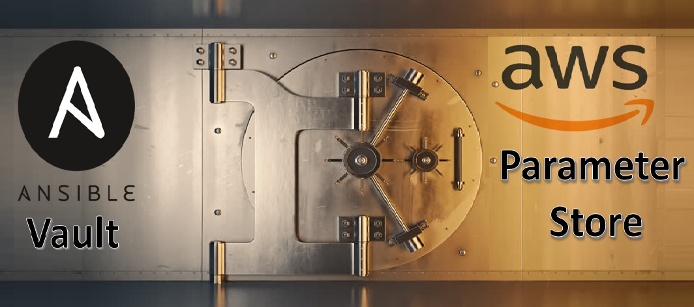

# ansible-vault


## About The Article

TThere are codes about article of "Working with sensitive data : Ansible Vault and using it with AWS Parameter Store". [To see the article of ansible-vault](https://cmakkaya.medium.com/working-with-sensitive-data-ansible-vault-and-using-it-with-aws-parameter-store-2f0c91c2b362)

In the first part of this article, we’ll talk about how to secure your sensitive content or confidential information, such as your passwords, API tokens, SSH public or private keys, SSL certificates, and password variables, with Ansible Vault.

In the second part of this article, we’ll talk about how to securely save and retrieve a password of a file created by ansible-vault, using the AWS SSM Parameter Store.

I’ll demonstrate how to use Ansible Vault and AWS SSM Parameter Store step by step on hands-on, by explaining some of the best practices for keeping the data safe.

You can build the following environment with terraform template to perform the tests mentioned in the article.

## Built With

* Terraform

This Terraform Template creates 3 Ansible Machines with ansible loaded on EC2 Instances.
Ansible Machines will run on Amazon Linux 2 with custom security group allowing SSH (22) and HTTP (80) connections from anywhere.
User needs to select appropriate variables form "tfvars" file when launching the instance.

* Or create manually this enviroment on your cloud provider.

### Prerequisites

This deployment can be deployed to an AWS environment. AWS account is required to run this deployment. Use the following link to create an access key and a secret access key.

- [Managing access keys for IAM users](https://docs.aws.amazon.com/IAM/latest/UserGuide/id_credentials_access-keys.html)

Git and Terraform are reqired for this deployment. 

- To install Git, go to the [Git website](https://git-scm.com/downloads).

- To install Terraform, go to the [Terraform Website](https://learn.hashicorp.com/tutorials/terraform/install-cli)


### Deployment

1. Clone the repo and go to the deployment directory.

```
git clone https://github.com/cmakkaya/ansible-vault
cd terraform-files/
```

2. Run aws configure to enter AWS keys on your computer. Choose region as us-east-1.

```
aws configure
```

3. Do not forget to define your key file path in main.tf file and your key name in myvars.auto.tfvars file correctly! 

4. Then, initialize the working directory.
```
terraform init
```

5. Run the below command to create an execution plan and review it.
```
terraform plan
```

6. Run the below command to execute the plan and enter yes when prompted.
```
terraform apply
```

7. connect to control_node with ssh command. Change your key file path, your key name ,and your control_node instance public ip below command. 
```
ssh -i ~/.ssh/cumhur.pem ec2-user@110.45.9.3 
```
## Troubleshooting

If the step 6 (Terraform apply) fails, run the apply command once again. If it keeps failing save the output logs and reach out to me on Github. 

## Cleanup

8. If the deployment is not needed anymore, run the following command to delete the deployment. Enter yes when prompted.
```
terraform destroy
```


# Connect with me 📫 You can learn more about me

- 🌐 [LinkedIn](https://www.linkedin.com/in/cumhurakkaya/)
- 🌐 [GitHub](https://github.com/cmakkaya/)
- 🌐 [GitLab](https://gitlab.com/cmakkaya)
- ✏️ [Medium Articles](https://cmakkaya.medium.com/)
- ✏️ [Wordpress Articles](https://cloudplatformsanddevops.wordpress.com/)
- 🏢 [Portfolio/Resume Page](https://portfolio.cmakkaya-awsdevops.link/)
- 📺 [YouTube](https://www.youtube.com/channel/UCWcRIvy70tBBfrmBocDR5hA)


# References for article

- 1. https://docs.ansible.com/ansible/latest/vault_guide/vault.html

- 2. https://www.oreilly.com/library/view/implementing-devops-with/9781787120532/51e56aa4-e786-469b-9794-9b1145592f28.xhtml

- 3. https://docs.ansible.com/ansible/latest/playbook_guide/playbooks_filters.html#hashing-and-encrypting-strings-and-passwords

- 4. https://docs.ansible.com/ansible/2.8/user_guide/vault.html#what-can-be-encrypted-with-vault

- 5. https://opensource.com/article/19/3/getting-started-vim

- 6. https://medium.com/geekculture/three-ways-to-use-secrets-in-ansible-922ae18df847